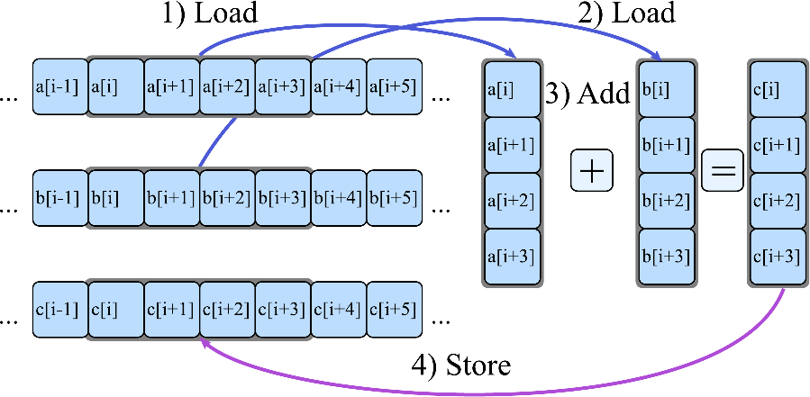
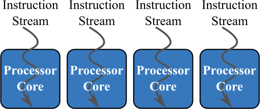
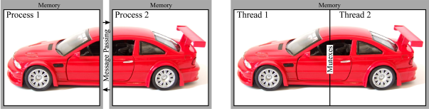
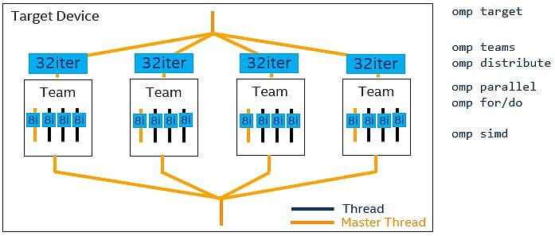

# Repositorio para las prácticas de la asignatura de CAP

## Setup
* En los Laboratorios FDI está instalado el entorno de [oneAPI](https://www.oneapi.io/) para que pueda ser utilizado por los alumnos
* Únicamente hay que tener en cuenta 3 cuestiones:
     1. Está instalado en el sistema operativo **GNU-Linux**
     2. El entorno (compiladores, herramientas y librerías) se activan cargando el script **setvars.sh**: ```source /opt/intel/oneapi/setvars.sh```. Es importante hacerlo cada vez que se abra una consola o terminal

```bash
user@host:~/ $ source /opt/intel/oneapi/setvars.sh 
 
:: initializing oneAPI environment ...
   bash: BASH_VERSION = 5.1.16(1)-release
   args: Using "$@" for setvars.sh arguments: 
:: advisor -- latest
:: ccl -- latest
:: clck -- latest
:: compiler -- latest
:: dal -- latest
:: debugger -- latest
:: dev-utilities -- latest
:: dnnl -- latest
:: dpcpp-ct -- latest
:: dpl -- latest
:: inspector -- latest
:: intelpython -- latest
:: ipp -- latest
:: ippcp -- latest
:: itac -- latest
:: mkl -- latest
:: mpi -- latest
:: tbb -- latest
:: vpl -- latest
:: vtune -- latest
:: oneAPI environment initialized ::

user@host:~/ $ sycl-ls 
[opencl:acc:0] Intel(R) FPGA Emulation Platform for OpenCL(TM), Intel(R) FPGA Emulation Device 1.2 [2023.15.3.0.20_160000]
[opencl:cpu:1] Intel(R) OpenCL, 12th Gen Intel(R) Core(TM) i7-12700 3.0 [2023.15.3.0.20_160000]
[opencl:gpu:2] Intel(R) OpenCL HD Graphics, Intel(R) UHD Graphics 770 [0x4680] 3.0 [22.28.23726.1]
[ext_oneapi_level_zero:gpu:0] Intel(R) Level-Zero, Intel(R) UHD Graphics 770 [0x4680] 1.3 [1.3.23726]
[ext_oneapi_cuda:gpu:0] NVIDIA CUDA BACKEND, Quadro P400 0.0 [CUDA 12.2]
```

No obstante, está disponible para los alumnos una [máquina virtual en formato Oracle Virtual Box](https://www.virtualbox.org) alojada en la [nube coorporativa de la UCM]() para que los alumnos puedan hacer los desarrollos fuera de los laboratorios de la FDI.

## Práctica 1 (Explotación paralelismo vectorial)
* Pequeños vectores = SIMD  (Single Instruction Multiple Data)



* Las instrucciones y códigos del [laboratorio 1](src/lab1/lab1.md)


## Práctica 2 (Explotación paralelismo OpenMP)
* Aplicación secuencial en sistema con varios cores



* Las instrucciones y códigos del [laboratorio 2](src/lab2/lab2.md)

## Práctica 3 (Explotación paralelismo distribuido con MPI)
* Explotación de paralelismo en sistemas de memoria distribuida



* Las instrucciones y códigos del [laboratorio 3](src/lab3/lab3.md)

## Práctica 4 (Explotación paralelismo heterogéneo con OpenMP)
* Explotación de paralelismo heterogéneo tipo CPU-GPU mediante el paradigma de programación de OpenMP



* Las instrucciones y códigos del [laboratorio 4](src/lab4/lab4.md) donde se abordarán ejemplos de:
    * Primeros casos de uso de la pragma ``target```
    * Recomendaciones de programación para explotar todos los niveles de paralelismo en una GPU de Intel (Slice, Subslice, EUs, SIMD) o en una de NVIDIA (GPU Processing Clusters-GPCs, Texture Processing Clusters-TPCs, Stream Multiprocessors-SMs, CUDA-cores...)
    * Minimización de transferencias por PCIe
    * Uso de herramientas de perfilado de Intel como [Intel-Advisor](https://www.intel.com/content/www/us/en/develop/documentation/advisor-user-guide/top/analyze-gpu-roofline.html) e [Intel-VTune](https://www.intel.com/content/www/us/en/develop/documentation/vtune-help/top/analyze-performance/accelerators-group/gpu-offload-analysis.html)
