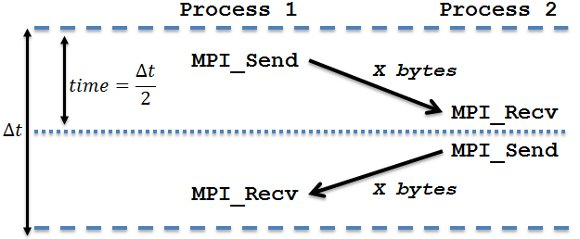
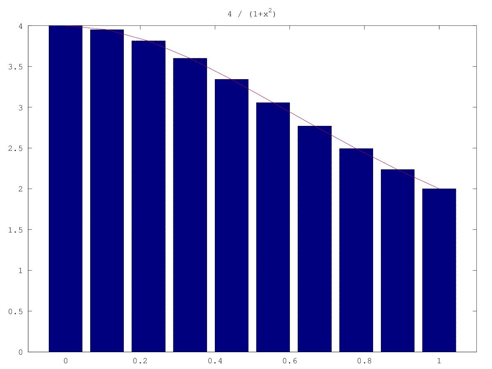
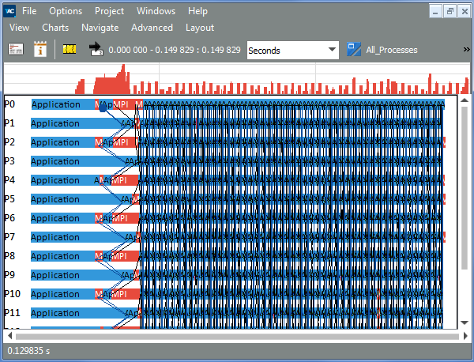
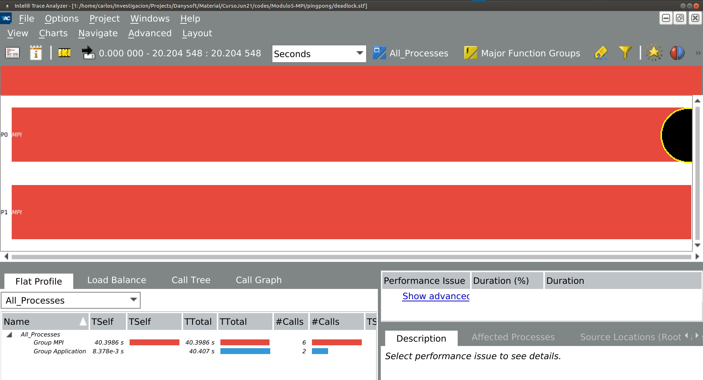
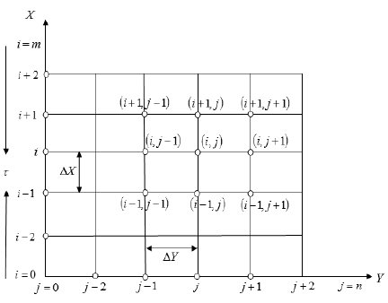
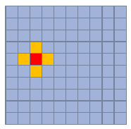
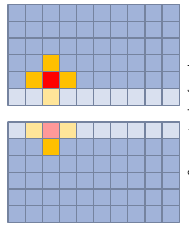
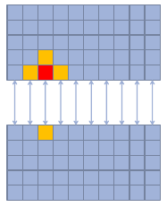
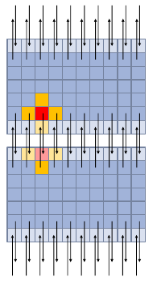

# Objetivos
## Objetivos
* Familiarizarse con la programación por medio de paso de mensaje en sistemas de memoria distribuida
* Evaluar las mejoras/speedup

# Recursos
## Recursos disponibles
* Recordad la información de la asignatura disponible en el Campus Virtual. 


# Entorno
## mpicc/mpiicx
* Soportado en la Intel® oneAPI HPC Toolkit
    * `mpicc` basado en GNU GCC
    * `mpiicx`basado en Intel(R) oneAPI DPC++/C++ Compiler

```bash
user@system:~$ mpiicx -o exec.icx src.c
user@system:~$ mpicc -o exec.gcc src.c
```

Variables de entorno
### Compilador de Intel
* Compilador de Intel (icc, icpc, ifort...)
* Intel® MPI Library incluido en Intel® oneAPI HPC Toolkit [^1]: ```mpiicc```, ```mpiicpc```, ```mpiifort```
    * GNU-GCC: ```mpicc```, ```mpic++```, ```mpifort```

```bash
user@lab:~ $ source /opt/intel/oneapi/setvars.sh 
:: initializing oneAPI environment ...
   bash: BASH_VERSION = 4.4.20(1)-release
:: advisor -- latest
:: ccl -- latest
:: clck -- latest
:: compiler -- latest
:: dal -- latest
:: debugger -- latest
:: dev-utilities -- latest
:: dnnl -- latest
:: dpcpp-ct -- latest
:: dpl -- latest
:: inspector -- latest
:: intelpython -- latest
:: ipp -- latest
:: ippcp -- latest
:: ipp -- latest
:: itac -- latest
:: mkl -- latest
:: mpi -- latest
:: tbb -- latest
:: vpl -- latest
:: vtune -- latest
:: oneAPI environment initialized ::
```

## Librería Intel MPI 
* Implementa el interfaz MPI con la especificación versión 3.1 (MPI-3.1) 
* Destacamos las siguientes características
    * Escalable hasta 340K procesadores
    * Baja sobrecarga en las Comunicaciones
    * Utilidad de tunning para acelerar el desarrollo de aplicaciones
    * Independencia en la tecnología de interconexión y de los fabricantes
    * Soporte C, C++, Fortran 77, Fortan 90, Fortran 2008
* Incluido en el **Intel® oneAPI HPC Toolkit** (el kit también incluye Intel Traze Analyzer/Collector e Intel Cluster Checker)


# Ejemplos
## Hello World
* Comprobar como se crea el comunicador, se asigna el *world_rank* y el *work_size*
* Conocer el nombre del sistema donde se ejecuta MPI

```c
#include <mpi.h>
#include <stdio.h>

int main(int argc, char** argv) {
    // Initialize the MPI environment
    MPI_Init(NULL, NULL);

    // Get the number of processes
    int world_size;
    MPI_Comm_size(MPI_COMM_WORLD, &world_size);

    // Get the rank of the process
    int world_rank;
    MPI_Comm_rank(MPI_COMM_WORLD, &world_rank);

    // Get the name of the processor
    char processor_name[MPI_MAX_PROCESSOR_NAME];
    int name_len;
    MPI_Get_processor_name(processor_name, &name_len);

    // Print off a hello world message
    printf("Hello world from processor %s, rank %d out of %d processors\n",
           processor_name, world_rank, world_size);

    // Finalize the MPI environment.
    MPI_Finalize();
}
```

* Para su compilación emplear el compilador `mpicc` o `mpiicx`
    * Preparado fichero "Makefile" que puede controlar el compilador con la variable `MPICC=mpicc`
* Para su ejecución se recomienda emplear `mpirun` con `-np` para indicar el número de procesos a lanzar (o el Makefile está preparado con 2 procesos)

```bash
user@system:~$ make
user@system:~$ make run
Hello world from processor system_name, rank 1 out of 2 processors
Hello world from processor system_name, rank 0 out of 2 processors

```

## Ping-Pong
* Comunicaciones punto a punto: `MPI_Send` & `MPI_Recv`



```c
void ping(int N) {
	MPI_Status status;

	double *buffer_send = (double*)malloc(N*sizeof(double));
	double *buffer_recv = (double*)malloc(N*sizeof(double));

	
	for (int i=0; i<N; i++) buffer_send[i]=i;

	double t1 = MPI_Wtime();
	MPI_Send(...);
	MPI_Recv(...);
	double t2 = MPI_Wtime();
	
	for (int i=0; i<N; i++) 
		if (buffer_send[i]!=buffer_recv[i]) {
			printf("ERROR in COMM: buffers differs\n");
			break;
		}
		
	printf("Ping pong done in %f secs.\n", t2-t1);
	
	free(buffer_send);
	free(buffer_recv);
}

void pong(int N) {
	MPI_Status status;
	double *buffer = (double*)malloc(N*sizeof(double));	

	MPI_Recv(...);
	MPI_Send(...);

	free(buffer);
}


int main( int argc, char *argv[] ) {
	int rank;
	int size;
	int N;
	
	setbuf (stdout, NULL);
	
	MPI_Init (&argc, &argv);
	MPI_Comm_rank(MPI_COMM_WORLD, &rank);
	MPI_Comm_size(MPI_COMM_WORLD, &size);
	
	N = atoi(argv[1]);
	
	if (rank == 0) ping(N);
	else pong(N);
	
	MPI_Finalize();
	
	return 0;
```

## Cálculo de PI

* Cómputo por medio de suma del área de los rectángulos
$\pi = \int_{0}^{1} \frac{4}{1+x^2} dx$
$\pi \approx \sum_{i=0}^{N} F(x_i) \Delta x$



* Código secuencial:

```c

	area = 0.0;

	for (int i=0; i<N; i++)
	{
		x = (i+0.5)/N;
		f = 4.0/(1.0 + x*x);
		area = f*(1.0/N); //F(x)*deltax
		pi+=area;
	}
    exactpi = 4.0*atan(1.0);
```

### Implementación paralela
* **Paralelización bucle for**
* Distribución de bloques de iteraciones
    * chunck=N/nprocs
    * Ej: 2 procs: 
        * rank=0 realizaría i=0 a N/2
        * rank=1 realizaría i=N/2 a N
* Reducción de las *pi\_local* en **pi**

```c

	...
	pi_local = 0.0;

	for (int i=?; i<?; i++)
	{
		x = (i+0.5)/N;
		f = 4.0/(1.0 + x*x);
		area = f*(1.0/N); //F(x)*deltax
		pi_local += area;
	}

	// REDUCE pi_local
	MPI_Reduce(...);
	... 
```

## Deadlocks
* Interbloqueos producidos porque la secuencia `MPI_Send`/`MPI_Recv`no se sigue: código ["deadlock.c"](deadlock/deadlock.c)
* Interbloque producidos porque las etiquetas-*tag* no sigue el orden correcto y por lo tanto **no se pueden emparejar**: código ["deadlock.c"](deadlock/deadlock_tag.c)

### Herramienta de análisis
La librería Intel® MPI permite controlar la información de depuración con la variable de entorno **I\_MPI\_DEBUG**

```bash
user@lab:$  mpirun  -genv I_MPI_DEBUG=2 -n 2 ./test
[0] MPI startup(): Intel(R) MPI Library, Version 2021.14  Build 20240911 (id: b3fc682)
[0] MPI startup(): Copyright (C) 2003-2024 Intel Corporation.  All rights reserved.
...
```
* También permite conocer el "tiempo" en el que se produce cada uno de los eventos

```bash
user@lab:$ mpirun -genv I_MPI_DEBUG=2,time,norank -n 2 ./test
11:59:59 MPI startup(): Multi-threaded optimized library
```

* O incluso redirigir la salida de la depuración con la variable de entorno **I\_MPI\_DEBUG\_OUTPUT**

```bash
user@lab:$ mpirun -genv I_MPI_DEBUG=2 -genv I_MPI_DEBUG_OUTPUT=/tmp/debug_output.txt -n 2 ./testc
```

* Distribución de procesos MPI
    * Información de ejecución con **I\_MPI\_DEBUG**
    * Imprime información de depuración cuando el programa MPI comienza
    * Valores entre 1 y 6 con niveles de detalla (0: no debug, 6: máximo)
    * Nivel razonable, I\_MPI\_DEBUG=4, imprime información sobre:
        * Process pinning
        * Interfaz de red usado
        * Variables de entorno seleccionadas en Intel MPI Library
    * Más info en el [MPI Library Developer Reference](https://www.intel.com/content/www/us/en/docs/mpi-library/developer-reference-linux/2021-14/overview.html)

### Herramienta Intel Trace Analyzer
* El [**Intel® Trace Analyzer**](https://www.intel.com/content/www/us/en/developer/tools/oneapi/trace-analyzer.html#gs.hah7s1) permite perfilar la ejecución de la biblioteca de MPI
    * Intercepta las llamadas a la biblioteca MPI y genera un fichero de traza
    * Dicho fichero se puede analizar con la herramienta Intel® Trace Analyzer

* El **Intel® Trace Analyzer** permite perfilar la ejecución de la biblioteca de MPI
* Pasos
    1. Generar la traza en la invocación del ```mpirun``` con la opción ```-trace (-t)```
        * Tras la ejecución un fichero .stf se genera
    2. Con la herramienta ```tracealalyzer``` se puede visualizar la traza

```bash
user@lab:$ mpirun -trace -n 4 ./myprog 
user@lab:$ traceanalyzer ./myprog.stf &
```

* En *Charts > Event Timeline*
    * Barras horizontales: llamadas a los procesos
    * Líneas negras: mensajes enviados entre procesos
    * Líneas azules: representan operaciones colectivas




*La herramienta *checker library (VTmc.so)* permite lincar dinámica la ejecución de un programa [MPI para evaluar posibles deadlocks](https://www.intel.com/content/www/us/en/docs/trace-analyzer-collector/tutorial-correctness-checking/9-1-update-2/instrumenting-an-example-with-a-deadlock.html))
    * ```-check_mpi``` dinámicamente linca con la librería de verificación de corrección (VTmc.so)
    * ```-genv VT_CHECK_TRACING on``` activa la escritura en el fichero de traza .stf para su posterior análisis con Intel® Trace Analyzer
    * ```-genv VT_DEADLOCK_TIMEOUT 20s``` si no hay progreso pasado el TIMEOUT escribe la traza y aborta la ejecución (asume DEADLOCK)
    * ```-genv VT_DEADLOCK_WARNING 25s``` muestra un warning pasado el DEADLOCK (puede producirse desbalanceo de carga o deadlock

* Ejemplo **deadlock**:

```bash
user@lab:$ mpirun -check_mpi -genv VT_DEADLOCK_TIMEOUT 20s -n 2 ./deadlock
....

process 0 of 2. Receiving..
process 1 of 2. Receiving..
[0] ERROR: no progress observed in any process for over 0:20 minutes, aborting application
[0] WARNING: starting premature shutdown

[0] ERROR: GLOBAL:DEADLOCK:HARD: fatal error
[0] ERROR:    Application aborted because no progress was observed for over 0:20 minutes,
[0] ERROR:    check for real deadlock (cycle of processes waiting for data) or
[0] ERROR:    potential deadlock (processes sending data to each other and getting blocked
[0] ERROR:    because the MPI might wait for the corresponding receive).
[0] ERROR:    [0] no progress observed for over 0:20 minutes, process is currently in MPI call:
[0] ERROR:       MPI_Recv(*buf=0x7ffde9f59670, count=8192, datatype=MPI_CHAR, source=1, tag=0, comm=MPI_COMM_WORLD, *status=0x7ffde9f5b6b8)
[0] ERROR:       main (/home/u78663/Danysoft/Modulo5-MPI/pingpong/deadlock.c:65)
[0] ERROR:       __libc_start_main (/lib/x86_64-linux-gnu/libc-2.27.so)
[0] ERROR:       _start (/home/u78663/Danysoft/Modulo5-MPI/pingpong/deadlock)
[0] ERROR:    [1] no progress observed for over 0:20 minutes, process is currently in MPI call:
[0] ERROR:       MPI_Recv(*buf=0x7ffef01b3de0, count=8192, datatype=MPI_CHAR, source=0, tag=0, comm=MPI_COMM_WORLD, *status=0x7ffef01b5e28)
[0] ERROR:       main (/home/u78663/Danysoft/Modulo5-MPI/pingpong/deadlock.c:65)
[0] ERROR:       __libc_start_main (/lib/x86_64-linux-gnu/libc-2.27.so)
[0] ERROR:       _start (/home/u78663/Danysoft/Modulo5-MPI/pingpong/deadlock)

[0] INFO: GLOBAL:DEADLOCK:HARD: found 1 time (1 error + 0 warnings), 0 reports were suppressed
[0] INFO: Found 1 problem (1 error + 0 warnings), 0 reports were suppressed.


===================================================================================
=   BAD TERMINATION OF ONE OF YOUR APPLICATION PROCESSES
=   RANK 0 PID 31670 RUNNING AT s001-n020
=   KILLED BY SIGNAL: 9 (Killed)
===================================================================================

===================================================================================
=   BAD TERMINATION OF ONE OF YOUR APPLICATION PROCESSES
=   RANK 1 PID 31671 RUNNING AT s001-n020
=   KILLED BY SIGNAL: 9 (Killed)
===================================================================================
mpirun -check_mpi -genv VT_CHECK_TRACING on -genv VT_DEADLOCK_TIMEOUT 20s -genv VT_DEADLOCK_WARNING 25s -genv VT_PCTRACE on -n 2 ./deadlock
```




# Tareas
## Ecuación del calor
* Resolución Numérica de Problemas de Transmisión de Calor

### Diferencias finitas
1. División del espacio considerado en una serie de elementos cuyas propiedades vienen representadas por un punto central (nodo)
2. Aplicación de balances de energía a cada elemento, obteniendo la ecuación característica para cada nodo.
3. Resolución simultánea de todos los balances, para obtener el perfil de temperaturas.
4. Si el caso lo requiere cálculo del flujo de calor con la ley de Fourier y el perfil de temperaturas.

* Considerando la ecuación del calor en 2 dimensiones:
$Q=-k A \frac{\partial T}{\partial x}\cong -k \frac{\Delta x T}{\Delta x} = -ḱ(W \Delta y)\frac{T_{i+1,j}-T_{i,j}}{\Delta x}$
    *  donde $Q$ se ha agregado como un término de generación de calor (positivo para la generación)



* Para una celda $(i,j)$ la aportación de calor $Q=Q_1+Q_2+Q_3+Q_4$ (celdas vecinas) donde:
    * $Q_1=\frac{T_{i,j+1}-T_{i,j}}{\Delta y / k(W \Delta x)}$
    * $Q_2=\frac{T_{i+1,j}-T_{i,j}}{\Delta x / k(W \Delta y)}$
    * $Q_3=\frac{T_{i-1,j}-T_{i,j}}{\Delta x / k(W \Delta y)}$
    * $Q_4=\frac{T_{i,j-1}-T_{i,j}}{\Delta y / k(W \Delta x)}$
* En el estado estacionario $Q_1+Q_2+Q_3+Q_4=0$
    * ... luego haciendo las sumas anteriormente descritas $T_{i,j}=\frac{T_{i,j+1}+T_{i,j-1}+T_{i+1,j}+T_{i-1,j}}{4}$

* Inicializa con un valor rand las coordenadas de la fuente de calor: ```source_x, source_y```
* Inicializa las condiciones de contorno
* Ejecución del bucle principal ``` (it < MAX_ITERATIONS) && (t_diff > MIN_DELTA) ```
* Salida en fichero .png que muestra el calor en una placa 2D

```c
	for (unsigned int it = 0; (it < MAX_ITERATIONS) && (t_diff > MIN_DELTA); ++it) {
		step(source_x, source_y, current, next);
		t_diff = diff(current, next);
		if(it%(MAX_ITERATIONS/10)==0){
			printf("%u: %f\n", it, t_diff);
		}

		float * swap = current;
		current = next;
		next = swap;
	}
```


* Tras 20000 iteraciones 


* Las rutinas a paralelizar son **step** y **diff**
   * **step**: esquema paralelización basado en **descomposición de dominios**
   * **diff**: reducción del *maxdiff*

```c
static void step(unsigned int source_x, unsigned int source_y, const float * current, float * next) {

	for (unsigned int y = 1; y < N-1; ++y) {
		for (unsigned int x = 1; x < N-1; ++x) {
			if ((y == source_y) && (x == source_x)) {
				continue;
			}
			next[idx(x, y, N)] = (current[idx(x, y-1, N)] +
			current[idx(x-1, y, N)] +
			current[idx(x+1, y, N)] +
			current[idx(x, y+1, N)]) / 4.0f;
		}
	}
}

static float diff(const float * current, const float * next) {
	float maxdiff = 0.0f;
	for (unsigned int y = 1; y < N-1; ++y) {
		for (unsigned int x = 1; x < N-1; ++x) {
			maxdiff = fmaxf(maxdiff, fabsf(next[idx(x, y, N)] - current[idx(x, y, N)]));
		}
	}
	return maxdiff;
}
```



* Lo más cómún es aplicar una descomposición interdependiente de los datos en diferentes procesos
    * Pero **no parece eficiente** tener que comunicar cada dato cada vez que procesa una celda



* Lo más cómún es aplicar una descomposición interdependiente de los datos en diferentes procesos
    * Es más conveniente añadir una filas de celdas "ghost" y comunicar las fronteras



* Lo más cómún es aplicar una descomposición interdependiente de los datos en diferentes procesos
    * Es más conveniente añadir una filas de celdas "ghost" y comunicar las fronteras en cada iteración


* Lo más cómún es aplicar una descomposición interdependiente de los datos en diferentes procesos
    * Más que comunicar, es converniente **intercambiar las celdas ghost**: `MPI_SEND`+ `MPI_RECV`



## Opcional
* Aplicar una descomposición de dominios 2D
    * NOTA: Para el intercambio de columnas crear una estructura del tipo MPI\_VECTOR


# Perfilado
## Intel APS-Application Performance Snapshot
* Vista rápida de algunos aspectos importantes en las aplicaciones de cómputo intensivo
* Más info en [guía de referencia](https://www.intel.com/content/www/us/en/docs/vtune-profiler/user-guide-application-snapshot-linux/2023-0/introducing-application-performance-snapshot.html)
    * Uso de MPI o OpenMP
    * Utilización de CPU
    * Acceso de memoria eficientes
    * Vectorización
    * E/S
    * Huella de la memoria

## Intel APS-Application Performance Snapshot
* Fácil y rápido (vista rápida)
    * Haz un test en lo que tardas en preparer un café
    * Toda la información de un vistazo
* MPI + OpenMP + Memory + Floating Point
    * Soporta implementaciones MPI comunes
    * Intel® MPI, MPICH, OpenMPI y Cray MPI


## Intel APS-Application Performance Snapshot
* Para ejecutar con mpi:
    * **mpirun -np 2 aps ./my_app my_app app_parameters**
    * Genera report HTML con el comando ```aps-report```

```bash
user@lab:$ mpirun -np 4 aps ./piparallel 100000
user@lab:$ aps-report aps_result_20241113_24bd0000-2035
```


